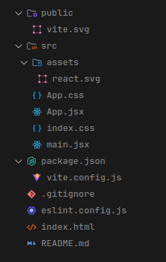
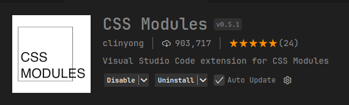
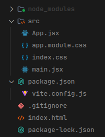
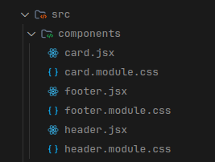

# Curso de React ( Projeto divulgação de vagas de emprego )

(1)
### O que é ReactJS ?

ReactJS é uma biblioteca JavaScript para construção de interfaces de usuário, desenvolvida pelo Facebook. Ele utiliza uma abordagem baseada em componentes, onde a interface é dividida em partes reutilizáveis, chamadas de componentes. React é eficiente, pois usa um sistema chamado "Virtual DOM" para atualizar a interface de forma rápida e otimizada, sem precisar recarregar a página inteira.

---

### Criando um projeto React com o ViteJS.
Ao criar um projeto utilizando o ReactJS podemos utilizar os seguintes boilerplates:

- Create React App (CRA)
- Vite

Quais as vantagens de utilizar Vite ao invés do CRA?

O Vite tem todos os recursos do CRA, mas com melhores implementações e recursos adicionais que o CRA não suporta, com isso o Vite acaba sendo até 10x mais rápido em comparação ao CRA.

---

### Criando o primeiro projeto com o Vite.
```javascript
  npm create vite@lastest

  // Após rodar o comando acima dê um nome ao projeto
  // Selecione o framework REACT
  // Selecione a variante Typescript ou Javascript
  // Em nosso projeto vamos utilizar REACT - JAVASCRIPT
```
---

### Após a instalação do Vite temos a seguinte estrututa de pasta.



---

### Para iniciar o projeto vamos rodar o seguinte comando:

```javascript
 npm install

// O comando acima instala as dependências que precisamos para rodar o código, após a instalação, digite o comando abaixo para iniciar o projeto:

 npm run dev

// No navegador de sua preferência acesse http://localhost:5173
 ```

---

 (2)

 ### Vamos fazer o "reset" no projeto.

 Vamos excluir as pastas: 
  - PUBLIC
  - ASSETS

Vamos excluir os arquivos:
 - App.css
 - eslint.config.js

 No arquivo <strong>App.jsx</strong> apague todo o conteúdo e crie da seguinte maneira:

 ```javascript
  export function App() {

  return (
    <div>
      <h1>hello world</h1>
    </div>
  )
}
 ```

 No arquivo <strong>index.css</strong> apague todo o conteúdo.

 E no arquivo main.jsx vamos fazer um pequeno ajuste:

 ```javascript
  import { StrictMode } from 'react'
  import { createRoot } from 'react-dom/client'
  import { App } from './App.jsx' // Coloque chaves entre App 
  import './index.css'

  createRoot(document.getElementById('root')).render(
    <StrictMode>
      <App />
    </StrictMode>,
)
 ```

 Assim já podemos iniciar nosso projeto do zero.

 ---

 (3)

 ### Estilização com CSS Modules

CSS Modules são uma maneira de aplicar estilos locais a componentes no React, garantindo que os nomes de classes sejam únicos e não causem conflito com outros estilos.

Instale a extensão do CSS Modules:



Dentro da pasta <strong>src</strong> crie um arquivo com o nome app.module.css, é no arquivo App.jsx importe esse arquivo:

```javascript
  import styles from './app.module.css' // Importamos o app.module.css

  export function App() {
    return (
      <div className={styles.container}> {/* Criamos uma classe container */}
        <h1>hello world</h1>
      </div>
    )
  }
```

Agora podemos ir no app.module.css é estilizar nossas tags HTML de forma única, desse modo se tivermos uma outra tag HTML com a mesma classe não temos o perigo de também estiliza-lá.

---

(4)

### JSX

É uma extensão do JavaScript bem semelhante ao HTML. Basicamente ele é uma sintaxe que o ReactJS utiliza para que possamos criar as nossas interfaces de forma declarativa.

O JSX utiliza funções dentro dos arquivos e o retorno dessas funções retornam tags HTML.

No arquivo App.jsx vamos estruturar da seguinte maneira nosso projeto:

```javascript
  import styles from "./app.module.css";

  export function App() {

  return (
    <div className={styles.container}>
      <header>
        <h1>Quadro de vagas</h1>
      </header>

      <main>
        <div className={styles.containerForm}>
          <h2>Divulgar nova vaga</h2>
          <p>Preencha os detalhes da vaga abaixo</p>

          <form>
            <input type="text" placeholder="Título da vaga" />
            <input type="text" placeholder="Nome da empresa" />
            <textarea placeholder="Descrição da vaga"></textarea>

            <button>Publicar vaga</button>
          </form>
        </div>

        <div className={styles.cards}>

          <div className={styles.card}>
            <div className={styles.infoJob}>
              <h3>Programador Reactjs</h3>
              <p>Codi Academy</p>
            </div>

            <p>Estamos contratando devs pra trabalhar no projeto frontend.</p>
          </div>

        </div>
      </main>

      <footer className={styles.footer}>
        <p>Copyright © {new Date().getFullYear()} - Todos os direitos reservados.</p>
      </footer>
    </div>
  );
}

```

---
(5)

### Estrutura de pastas



<br>

📁 node_modules - A pasta onde ficam todas dependências e módulos do nosso projeto.

📁 src - Pasta principal onde ficará todos os nossos arquivos.

App.jsx - Página inicial do nosso projeto que será exibida no navegador.

app.module.css - Arquivo de estilização do App.jsx 

index.css - Arquivo de estilização global logo.svg - Arquivo de imagem da logo do ReactJS. 

main.jsx - Arquivo responsável por inicializar nossa aplicação.

index.html - Arquivo HTML onde será injetado todo o JavaScript que for compilado para ser exibido no navegador.

.gitignore - Esse arquivo descreve quais arquivos e pasta não devem subir para o Github. 

package.json - Arquivo responsável pelas dependências do nosso projeto. Contém informações do pacote, como: scripts, dependências, número de versão e etc...

package-lock.json - Parecido com o package.json, esse arquivo descreve as características das dependências do projeto como versão, integridade dos links e muito mais.

vite.config.js - Arquivo de configuração do Vite.

---

### Importando fontes 

Vamos importar uma fonte para nosso projeto. Acesse https://fonts.google.com/specimen/Moderustic 

No index.html coloque o código da fonte dentro do head: 

```javascript
  <!doctype html>
  <html lang="pt-br">
    <head>
      <meta charset="UTF-8" />
      <link rel="icon" type="image/svg+xml" href="/vite.svg" />
      <meta name="viewport" content="width=device-width, initial-scale=1.0" />

      <!--FONTE GOOGLE-->
      <link rel="preconnect" href="https://fonts.googleapis.com">
      <link rel="preconnect" href="https://fonts.gstatic.com" crossorigin>
      <link href="https://fonts.googleapis.com/css2?family=Moderustic:wght@300..800&display=swap" rel="stylesheet">
      <!--FONTE GOOGLE-->

      <title>Jobs</title>
    </head>
    <body>
      <div id="root"></div>
      <script type="module" src="/src/main.jsx"></script>
    </body>
  </html>
```

Altere também na tag title o título do projeto e em html lang troque a linguegem para pt-br.

---

(6)

### Componentes 

 No React, os componentes são blocos reutilizáveis que encapsulam a lógica e a interface. Eles podem ser comparados a funções no JavaScript, que aceitam entradas (props) e retornam elementos JSX (a interface do usuário).

 Em nosso projeto podemos criar componentes para deixar nosso código mais organizado.

 Vamos criar dentro da pasta <strong>src</strong> uma pasta com o nome <strong>components</strong>.
 
Crie um componente com o <strong>header.jsx</strong> é um arquivo <strong>header.module.css</strong>

Faça também para as tags <strong>footer</strong> e a div com a className <strong>card</strong>



Agora nosso código está com os componentes que precisamos. Repara que nosso código fica mais organizado

```javascript
import styles from "./app.module.css";
import { Card } from "./components/card";
import { Footer } from "./components/footer";
import { Header } from "./components/header";

export function App() {
  return (
    <div className={styles.container}>
      <Header />

      <main>
        <div className={styles.containerForm}>
          <h2>Divulgar nova vaga</h2>
          <p>Preencha os detalhes da vaga abaixo</p>

          <form>
            <input type="text" placeholder="Título da vaga" />
            <input type="text" placeholder="Nome da empresa" />
            <textarea placeholder="Descrição da vaga"></textarea>

            <button onClick={handleCreateJob}>Publicar vaga</button>
          </form>
        </div>

        <div className={styles.cards}>
          <Card />
        </div>
      </main>

      <Footer />
    </div>
  )
}
```

--- 

(7)

### Vamos deixar nosso projeto estilizado

No arquivo <strong>index.css</strong> adicione as seguintes propriedades onde se aplica em todo projeto: 

```css

  /* Cores que vamos usar no projeto */
  :root {
  --zinc-950: #09090b;
  --zinc-900: #18181b;
  --zinc-700: #3f3f46;
  --purple-700: #7e22ce;
  --purple-800: #6b21a8;
  --white: #ffffff;
}


* {
  margin: 0; /* reset da margem global */
  padding: 0; /* reset do padding global */
  box-sizing: border-box; /* garante um comportamento mais previsível ao definir tamanhos e facilita a construção de layouts */
  font-family: 'Moderustic', sans-serif; /* Aplicando fonte em todo projeto */
}

body {
  background-color: var(--zinc-950); /* Background na página */
  color: var(--white); /* cor de texto */
} 

button {
  border: 0; /* Removendo a borda dos botões */
}
```

No arquivo <strong>app.module.css</strong> adicione as seguintes propriedades css:

```css
.container {
  max-width: 48rem; // Adicionando uma largura máxima ao layout 748px em rem 48
  width: 100%; // Largura de 100%
  margin: 0 auto; // Margem no eixo Y 0 e no eixo X auto dessa forma centraliza o layout ao centro
  padding-inline: 1.25rem; // Adicionando um paddind nas laterias, dessa forma deixamos nosso projeto responsivo
 
  display: flex; // Adicionando display flex
  flex-direction: column; // Elementos um abaixo do outro
  height: 100vh; // Ocupa uma altura de 100 view height da tela

  main {
    flex: 1; // É uma maneira eficiente de fazer com que um elemento ocupe todo o espaço disponível em um contêiner flexível.
  }
}

.containerForm {
  margin-top: 1.5rem; // Margem no topo

  border: 1px solid var(--zinc-700); // Aplica uma borda sólida
  border-radius: 6px; // Arredondamento nas bordas
  padding: 1.5rem; // Padding de 24px

  form {
    margin-top: 1rem; // Margem topo no formulário
    display: flex; // Aplica display flex
    flex-direction: column; // Elementos um abaixo do outro
    gap: 1rem; // Espaço entre elementos de 16px

    input {
      background-color: var(--zinc-900); // Background nos inputs
      border: 1px solid var(--zinc-700); // Borda no input
      border-radius: 6px; // Arredondamento nas bordas
      padding: 1rem; // Padding de 16px
      color: var(--white); // Cor do texto
      outline: none; // Remove o outline do input
    }

    input:focus {
      border: 1px solid var(--purple-700); // se o input estiver focado aplica uma borda purple
    }

    textarea {
      background-color: var(--zinc-900); // Background nos inputs
      border: 1px solid var(--zinc-700); // Borda no input
      border-radius: 6px; // Arredondamento nas bordas
      padding: 1rem; // Padding de 16px
      color: var(--white); // Cor do texto
      outline: none; // Remove o outline do input
      resize: none; // Não deixa o usuário mexer na altura ou na largura do textArea
    }

    textarea:focus {
      border: 1px solid var(--purple-700); // se o input estiver focado aplica uma borda purple
    }

    button {
      background-color: var(--purple-700); // Background nos inputs
      color: var(--white); // Cor do texto
      font-weight: bold; // Peso do texto
      border-radius: 6px; // Arredondamento das bordas do botão
      padding: 1rem; // Paddind de 16px
      cursor: pointer; // Cursor pointer no botão
    }

    button:hover {
      background-color: var(--purple-800); // Quando o cursor passar no botão aplicar um efeito
    }
  }
}

.cards {
  border-top: 1px solid var(--zinc-700); // Aplicando uma borda no topo
  margin-top: 1.5rem; // Margem no topo 24px
  padding-top: 1.5rem;  // Paddind no topo 24px
  display: grid; // Aplicando display grid
  grid-template-columns: repeat(2, 1fr); // Deixando dois elementos por linhas 
  gap: 1rem; // Espaços entre elementos
}

// Usando @media 
@media(max-width: 768px) {
  .cards { 
    grid-template-columns: 1fr; // Deixando um elemento por linha quando o projeto estiver sendo exibido em um mobile.
  }
}
```

No arquivo <strong>header.module.css</strong> adicione as seguintes propriedades css:

```css
.header {
  padding: 1rem 0; // Padding no eixo Y e 0 no eixo X

  border-bottom: 1px solid var(--zinc-700); // Borda no bottom
}
```

No arquivo <strong>card.module.css</strong> adicione as seguintes propriedades css:

```css
.card {
  background-color: var(--zinc-900); // Background no card
  border: 1px solid var(--zinc-700); // Borda no card
  border-radius: 6px; // Arredodamento nas bordas do card
  padding: 1.5rem; // Padding de 24px

  display: flex; // Aplicando display flex
  flex-direction: column; // Deixando os elementos um abaixo do outro

  gap: 1.5rem; // Espaço entre os elementos

  .infoJob {
    h3 {
      font-size: 1.5rem; // Tamanho da fonte
    }

    p {
      color: var(--purple-700); // Cor do texto
      font-size: 0.875rem; // Tamanho da fonte
    }
  }
}
```

No arquivo <strong>footer.module.css</strong> adicione as seguintes propriedades css:

```css
  .footer {
    text-align: center; // Centralizando o texto do footer
    margin-top: 2rem; // Margem topo 
    padding: 1rem 0; // Padding no eixo Y de 16px e 0 no eixo X
    border-top: 1px solid var(--zinc-700); // Aplicando uma borda no topo
}
```

(8)

### Propriedades

Agora temos o nosso projeto todo estilizado. 

Mas queremos dar vida ao projeto.

O que são: Propriedades (ou props) são os dados que um componente pai passa para um componente filho. Elas permitem que os componentes sejam reutilizáveis e dinâmicos.

Vamos enviar dados para o nosso componente CARD que está no arquivo <strong>App.jsx</strong> usando propriedades, veja abaixo:

```javascript
<div className={styles.cards}>
  <Card
    title="Programador Reactjs"
    company="Codi Academy"
    description="Estamos contratando devs pra trabalhar no projeto frontend."
  />
</div>
```

Dessa maneira agora estamos enviando dados via props para nosso componente CARD.

Veja agora como pegamos essas informações. Vamos no arquivo <strong>card.jsx</strong> dentro da pasta <strong>src</strong> como pode ser visto abaixo:

```javascript
  import styles from "./card.module.css"

  export function Card({ title, company, description }) {
    return (
      <div className={styles.card}>
        <div className={styles.infoJob}>
          <h3>{title}</h3>
          <p>{company}</p>
        </div>

        <p>{description}</p>
      </div>
    );
  }

```

Pegamos title, company é description enviados via props e passamos para as tags HTML correnspondentes 

Você pode reparar que agora nos card está sendo exibido com os dados que enviamos, podemos criar outros CARD com dados diferentes:

```javascript

    <div className={styles.cards}>
      <Card
        title="Programador Reactjs"
        company="Codi Academy"
        description="Estamos contratando devs pra trabalhar no projeto frontend."
      />

      <Card
        title="Programador Fullstack"
        company="Umbrella Corporation"
        description="Estamos contratando devs pra trabalhar no projeto fullstack."
      />

      <Card
        title="Programador Backend"
        company="Facebook"
        description="Estamos contratando devs pra trabalhar no projeto backend."
      />
    </div>
```

Temos outros cards com dados diferentes.

---

(9)

### Estados

O que é o estado: O estado é uma forma de armazenar dados dentro de um componente React. O hook useState permite adicionar estados a componentes funcionais. Esses dados podem ser alterados ao longo do tempo e refletem diretamente na interface quando mudam.

Vamos criar nossos primeiros estados. 

Precisamos guardar nossos dados em algum lugar para usar certo? Veja abaixo como usar o hook <strong>useState</strong>:

```javascript
export function App() {
  const [title, setTitle] = useState("");
  const [company, setCompany] = useState("");
  const [description, setDescription] = useState("");


  return (
```

```javascript
  const [title, setTitle] = useState("")

  // title é o nome da nossa variável

  // setTitle permite que você atualize o valor do estado e o React automaticamente re-renderiza o componente quando o estado é alterado
```

Agora podemos armazer o que o usuário digitar no formulário.

Vamos usar o <strong>onChange</strong> nos inputs para capturar e armazenar o que está sendo digitado:

```javascript
  <form>
    <input
      onChange={(e) => setTitle(e.target.value)}
      value={title}
      type="text"
      placeholder="Título da vaga"
    />
    <input
      onChange={(e) => setCompany(e.target.value)}
      value={company}
      type="text"
      placeholder="Nome da empresa"
    />
    <textarea
      onChange={(e) => setDescription(e.target.value)}
      value={description}
      placeholder="Descrição da vaga"
    ></textarea>

    <button onClick={handleCreateJob}>Publicar vaga</button>
  </form>
```

```javascript
  onChange={(e) => setTitle(e.target.value)} // Passando para a função setTitle o que sendo digitado no input para armazenar na variável title
  value={title} // Valor do input é title
```

Pronto já conseguimos pegar o que o usuário está digitando no formulário.

___

(10)

### Imutabilidade

O React usa a imutabilidade para determinar quando um componente deve ser atualizado. Quando o estado ou as props mudam, o React compara a versão anterior com a nova cópia (usando o conceito de shallow comparison), e, se houver mudanças, o componente é re-renderizado.

Vamos deixar nosso projeto dinâmico. Veja abaixo:

```javascript
  import { useState } from "react";
  import styles from "./app.module.css";
  import { Card } from "./components/card";
  import { Footer } from "./components/footer";
  import { Header } from "./components/header";

export function App() {
  const [title, setTitle] = useState("");
  const [company, setCompany] = useState("");
  const [description, setDescription] = useState(""); 

  const [jobs, setJobs] = useState([]); // Estado onde vamos armazenar as vagas em um Array vazio

  // Função onde vamos criar os novos Jobs
  function handleCreateJob(event) {
    event.preventDefault() // Removendo o comportamento default do formulário, assim ele nao envio pra lugar nenhum os dados é nao dar um reload na tela

    // Criando um objeto com os dados da vaga
    const newJobs = {
      id: crypto.randomUUID(), // Usando o crypton para gerar um ID
      title, // Passando o título que o usuário digitou
      company, // Passando o nome da empresa
      description // Passando a descrição da vaga
    }

    setJobs([newJobs, ...jobs]) // Passando nosso estado Jobs a nova vaga é usando o Spread Operator (...) para retorna junto o que já tiver em nosso estado Jobs
 
    setTitle("") // Limpando nosso input para o valor inicial do estado
    setCompany("") // Limpando nosso input para o valor inicial do estado
    setDescription("") // Limpando nosso input para o valor inicial do estado
  }

  return (
    <div className={styles.container}>
      <Header />

      <main>
        <div className={styles.containerForm}>
          <h2>Divulgar nova vaga</h2>
          <p>Preencha os detalhes da vaga abaixo</p>

          <form>
            <input
              onChange={(e) => setTitle(e.target.value)}
              value={title}
              type="text"
              placeholder="Título da vaga"
            />
            <input
              onChange={(e) => setCompany(e.target.value)}
              value={company}
              type="text"
              placeholder="Nome da empresa"
            />
            <textarea
              onChange={(e) => setDescription(e.target.value)}
              value={description}
              placeholder="Descrição da vaga"
            ></textarea>

            <button onClick={handleCreateJob}>Publicar vaga</button>
          </form>
        </div>

        <div className={styles.cards}>
         {/* Usando o map para percorrer o array jobs e renderizar com os dados os cards */}
          {jobs.map(job => (
            <Card
              key={job.id}
              title={job.title}
              company={job.company}
              description={job.description}
            />
          ))}
        </div>
      </main>

      <Footer />
    </div>
  );
}

```

----

(11)

### Rederização condicional

A renderização condicional permite que você exiba ou oculte elementos com base em condições específicas. No React, isso geralmente é feito utilizando operadores lógicos como && ou o ternário ? :.

Veja abaixo:

```javascript
  {jobs.length === 0 ? (
      <p 
        style={{ textAlign: "center", marginTop: "2rem" }}
      >
        Nenhuma vaga publicada.
      </p>
     ) : (
      <div className={styles.cards}>
      {jobs.map(job => (
        <Card
          key={job.id}
          title={job.title}
          company={job.company}
          description={job.description}
      />
      ))}
    </div>
  )}
```

Se Jobs for igual a 0 o react exibirá o paragráfo "Nenhuma vaga publicado", mas se ele não for igual a 0 exibirá os CARDS com os dados das vagas.

---

<strong>introdução aos 80% dos conceitos do React que você usará diariamente.</strong>

